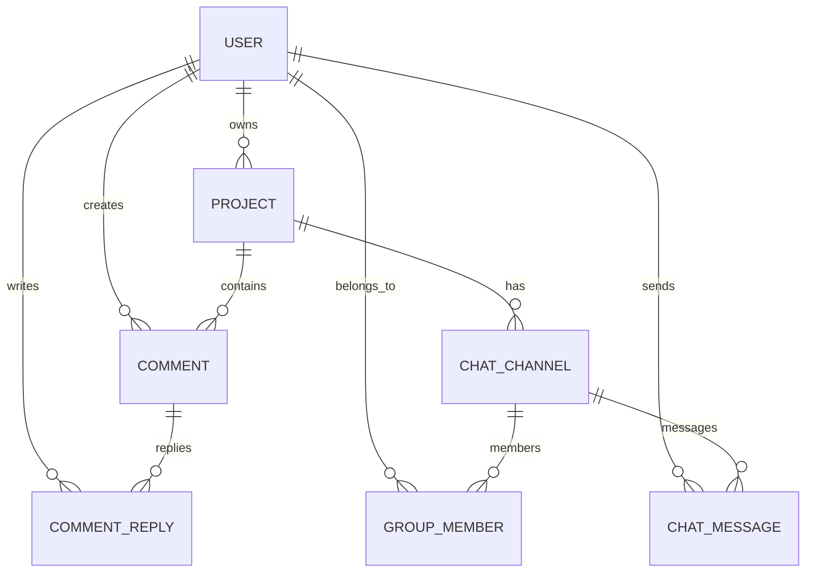

# ENG PLANNER - Comprehensive Project Documentation

---

## 1. Executive Overview

**ENG PLANNER** is a high-performance, web-based 2D CAD engineering workspace and collaborative project hub. It empowers structural engineers, architects, and MEP coordinators to draft precision CAD blueprints, import DXF / PDF / image files, drop spatial discussion pins directly on drawing geometry, coordinate across real-time project channels, and consult an inline engineering AI copilot (**EngiAI**).

---

## 2. Technology Stack & System Architecture

```
+-----------------------------------------------------------------------------------+
|                                 CLIENT TIER                                       |
|                                                                                   |
|  React 18 + TypeScript + Vite 5 + TailwindCSS                                     |
|  React Konva (HTML5 2D Canvas Engine)                                             |
|  Zustand (State Management & View Persistence)                                    |
|  Socket.io Client (Sub-5ms Real-Time Multiplayer Sync)                            |
|  PDF.js + Dxf-Parser / DXF-Writer (Document/Vector Processing)                    |
+----------------------------------------+------------------------------------------+
                                         |
                       HTTP / WebSocket  | (Reverse Proxy / Port 5005)
                                         v
+-----------------------------------------------------------------------------------+
|                                 SERVER TIER                                       |
|                                                                                   |
|  Node.js + Express + TypeScript                                                   |
|  Socket.io Server (Room-based Pub/Sub Architecture)                               |
|  Prisma ORM (Data Layer)                                                          |
|  Resilient In-Memory TTL Cache (with Optional Redis Fallback)                     |
|  EngiAI Engine (Gemini API Integration with Deterministic Engineering Fallback)   |
+----------------------------------------+------------------------------------------+
                                         |
                                         v
+-----------------------------------------------------------------------------------+
|                                DATABASE TIER                                      |
|                                                                                   |
|  MySQL 8.x / MariaDB via WAMP / Docker                                            |
|  Models: User, Project, Comment, CommentReply, ChatChannel, GroupMember,          |
|          ChatMessage                                                              |
+-----------------------------------------------------------------------------------+
```

### Core Technologies
- **Frontend**: React 18, TypeScript, Vite, TailwindCSS, React Konva, Lucide React, Axios, Zustand.
- **Backend**: Node.js, Express, TypeScript, Socket.io, Prisma ORM, JSON Web Tokens (JWT), Bcryptjs.
- **Database**: MySQL 8.x (Storage Engine: InnoDB / MyISAM).
- **Caching**: High-performance in-memory TTL Map cache with automatic Redis fallback.

---

## 3. Database Architecture & Schema (Prisma)

### Data Models Overview



### Entity Specifications

1. **`User`**:
   - `id`: UUID Primary Key (`VarChar(191)`).
   - `email`: Unique email string.
   - `password`: Bcrypt hashed password.
   - `fullName`: Engineer's display name.
   - `role`: Enum (`ENGINEER`, `ARCHITECT`, `ADMIN`).

2. **`Project`**:
   - `id`: UUID Primary Key (`VarChar(191)`).
   - `title`: Workspace title string.
   - `description`: Textual project summary.
   - `canvasData`: JSON object storing `elements[]`, `version`, and `scale`.
   - `thumbnail`: LongText string (Base64 dataUrl).
   - `userId`: Foreign key to `User` with `CASCADE` delete.
   - `isArchived`, `isPublic`: Boolean flags.

3. **`Comment` & `CommentReply`**:
   - `Comment`: Spatial pin on the canvas with coordinates `(x, y)`, `text`, `isResolved`, and `projectId`.
   - `CommentReply`: Threaded responses with foreign key to `Comment` and `User`.

4. **`ChatChannel` & `GroupMember`**:
   - `ChatChannel`: Channel entity scoped to a `projectId` (e.g. `#general`, `#engi-ai`, `#structural-review`).
   - `GroupMember`: Bridge entity linking `ChatChannel` and `User` with explicit index `@@unique([channelId, userId])` (`@db.VarChar(100)` for MySQL utf8mb4 index safety).

5. **`ChatMessage`**:
   - `id`: UUID Primary Key.
   - `channelId`: Foreign key to `ChatChannel`.
   - `userId`: Nullable foreign key to `User` (null when generated by AI bot).
   - `isAi`: Boolean flag for EngiAI copilot responses.
   - `content`: Text message body.
   - `attachments`: JSON array storing spatial canvas attachments `{ type: 'CANVAS_VIEW', x, y, scale }`.

---

## 4. REST API Endpoint Directory

All endpoints are prefixed with `/api/v1`.

### A. Authentication (`/api/v1/auth`)
| Method | Endpoint | Description | Auth Required |
| :--- | :--- | :--- | :--- |
| `POST` | `/auth/register` | Registers a new engineer profile | No |
| `POST` | `/auth/login` | Authenticates user & returns JWT token | No |
| `GET` | `/auth/me` | Returns current user profile from token | Bearer JWT |

### B. Projects (`/api/v1/projects`)
| Method | Endpoint | Description | Auth Required |
| :--- | :--- | :--- | :--- |
| `GET` | `/projects` | Lists all projects (`?archived=true/false`) | Bearer JWT |
| `POST` | `/projects` | Creates a new CAD project workspace | Bearer JWT |
| `GET` | `/projects/:id` | Fetches workspace details and `canvasData` | Bearer JWT |
| `PUT` | `/projects/:id/save` | Updates and persists project `canvasData` | Bearer JWT |
| `PUT` | `/projects/:id/rename` | Renames project title | Bearer JWT |
| `PUT` | `/projects/:id/archive` | Toggles project archive status | Bearer JWT |
| `PUT` | `/projects/:id/public` | Toggles public sharing status | Bearer JWT |
| `DELETE` | `/projects/:id` | Deletes project and cascades dependencies | Bearer JWT |
| `GET` | `/projects/shared/:id` | Public read-only access for shared blueprints | No |

### C. Spatial Comments (`/api/v1/comments`)
| Method | Endpoint | Description | Auth Required |
| :--- | :--- | :--- | :--- |
| `GET` | `/projects/:projectId/comments` | Fetches all spatial discussion pins | Bearer JWT |
| `POST` | `/projects/:projectId/comments` | Creates discussion pin at world `(x, y)` | Bearer JWT |
| `POST` | `/comments/:id/reply` | Adds threaded reply to discussion pin | Bearer JWT |
| `PUT` | `/comments/:id/resolve` | Toggles resolution status of discussion pin | Bearer JWT |
| `DELETE`| `/comments/:id` | Permanently removes comment and replies | Bearer JWT |

### D. In-App Messenger & Channels (`/api/v1`)
| Method | Endpoint | Description | Auth Required |
| :--- | :--- | :--- | :--- |
| `GET` | `/projects/:projectId/channels` | Fetches project channels (auto-creates defaults) | Bearer JWT |
| `POST` | `/projects/:projectId/channels` | Creates a custom team group channel | Bearer JWT |
| `GET` | `/channels/:channelId/messages` | Fetches chronological message history | Bearer JWT |
| `POST` | `/channels/:channelId/messages` | Posts message (triggers EngiAI if `@ai` mentioned) | Bearer JWT |
| `POST` | `/channels/:channelId/members` | Invites team members to group channel | Bearer JWT |
| `DELETE`| `/channels/:channelId/members/:userId` | Removes member from group channel | Bearer JWT |
| `GET` | `/users/available` | Lists all registered engineers for invites | Bearer JWT |

---

## 5. Real-Time WebSockets Protocol

Real-time collaboration is powered by Socket.io across dedicated project and channel rooms:

```
[Client] ---> join-project (projectId) --------> [Server Room: project:ID]
[Client] ---> cursor-move (world X, Y) -------> [Broadcast to others (throttled 40ms)]
[Client] ---> element-added / updated ---------> [Broadcast to others]
[Client] ---> join-channel (channelId) --------> [Server Room: channel:ID]
[Client] ---> send-channel-message ------------> [Broadcast to channel members]
```

### Event Specifications:
1. `join-project` / `leave-project`: Subscribes socket to workspace events.
2. `cursor-move`: Broadcasts remote cursor coordinates with user name and role badge (throttled at 40ms / 25 FPS).
3. `element-added`, `element-updated`, `element-removed`: Broadcasts CAD modifications to all connected engineers.
4. `join-channel` / `leave-channel`: Subscribes socket to group channel discussions.
5. `send-channel-message` / `channel-message-received`: Delivers chat messages and `@ai` responses in sub-5ms latency.

---

## 6. 2D CAD Engine Architecture

### A. Coordinate Mapping & Transformation
The canvas utilizes world-to-screen and screen-to-world linear affine transformations:
$$\text{ScreenX} = \text{WorldX} \times \text{Scale} + \text{StagePosX}$$
$$\text{ScreenY} = \text{WorldY} \times \text{Scale} + \text{StagePosY}$$
$$\text{WorldX} = \frac{\text{ScreenX} - \text{StagePosX}}{\text{Scale}}$$
$$\text{WorldY} = \frac{\text{ScreenY} - \text{StagePosY}}{\text{Scale}}$$

### B. Interactive Drafting Tools
- **Line & Polyline**: Continuous segmented drafting with ortho-snapping ($0^\circ, 90^\circ, 180^\circ, 270^\circ$).
- **Circle & Arc**: Radius and angular sweep calculation.
- **Rectangle & Area**: Automatic perimeter and square meter / square foot area computation.
- **Dimension & Leader**: Interactive linked dimensioning that automatically updates measurements when connected geometry moves.
- **Object Snapping**: Real-time magnetic snapping to endpoints, midpoints, circle centers, and grid intersections.

### C. Right-Click Context Menu (`CanvasContextMenu.tsx`)
- Right-clicking any image or CAD entity opens a context menu with options:
  - 🗑️ **Delete Element** (`Del` / `Backspace`).
  - 🔒 **Lock / Unlock in Place** (secures background blueprints).
  - ⬇️ **Send to Back (Background)** (sits uploaded blueprints under CAD lines).
  - ⬆️ **Bring to Front**.
  - 🔄 **Rotate 90° Clockwise / Counter-Clockwise**.
  - 📋 **Duplicate** (+30px offset).
  - 🎨 **Opacity Presets** (25%, 50%, 75%, 100% for blueprint tracing).
  - 📍 **Drop Discussion Pin**.

---

## 7. Multi-Tier Persistence & Refresh Reliability

```
User Action (Delete / Duplicate / Draw)
   │
   ├─► Zustand Store Update (Optimistic UI)
   ├─► Socket Broadcast (Multiplayer Sync)
   └─► useAutoSave Trigger (400ms Debounce)
          │
          ├─► Normal Path: PUT /api/v1/projects/:id/save (JSON payload)
          │
          └─► Page Refresh / Close: beforeunload Flush
                 └─► fetch(url, { keepalive: true, headers: { Authorization } })
```

- **Isolated Project State**: `elements` are excluded from global `localStorage` partialize to prevent cross-project cache collisions.
- **`isProjectLoaded` Guard**: Auto-save is suspended during initial MySQL fetch, preventing initial blank states from overwriting database records.
- **Unload Keep-Alive Flush**: Guaranteed delivery of unsaved canvas state during abrupt browser refreshes.

---

## 8. Infrastructure & Production Performance Tuning

To ensure stability in production environments, several critical optimizations have been implemented:

### A. Nginx Static Asset Routing
- Implemented specific location blocks (`location ^~ /uploads/`) to guarantee Nginx intercepts and serves all user-uploaded canvas imagery directly without reverse-proxying back to the Node backend, eliminating 404 errors during complex dashboard loads.

### B. React Konva Canvas Rendering Optimization
- **Layer Consolidation**: Refactored the core CAD canvas to render all tools (Grid, Drawing, Remote Cursors, Overlays, and Comment Pins) into a single master `<Layer id="main-layer">` utilizing modular `<Group>` components instead of individual layers. This fundamentally resolves the standard Konva memory warning (which warns against >5 layers) and drastically reduces WebGL memory footprint and memory spikes.

### C. Host Machine Configuration
- **Redis Overcommit**: Enabled `vm.overcommit_memory=1` on the production host machine. This allows the Redis cache to safely execute background saves and data replication without crashing during memory-intensive container operations.

### D. Prisma Relational Consistency
- Strict foreign key and relational cascade rules are maintained in `schema.prisma` across the `User`, `ChatChannel`, and `Comment` models. This ensures controller-level operations utilizing `include: { user: true }` joins execute flawlessly across the real-time websocket and REST architectures without triggering 500 Internal Server Errors.
