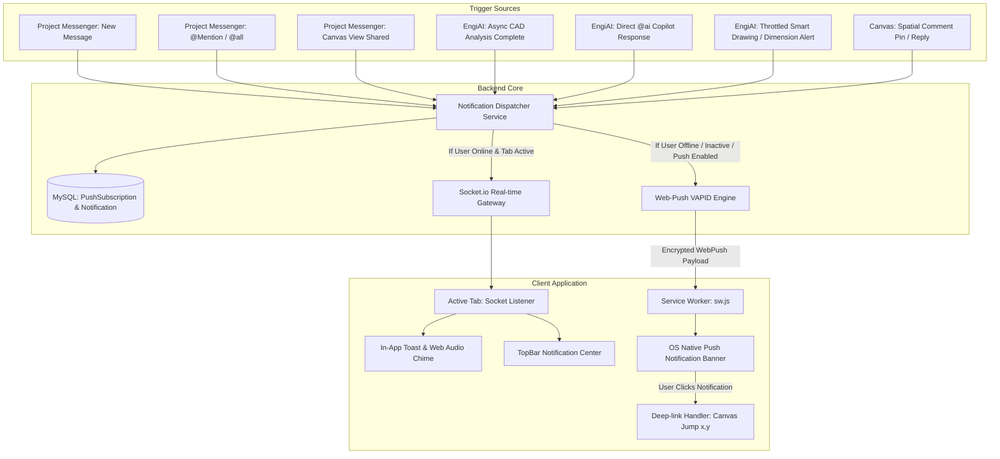

# Push Notification System Implementation Plan (EngiAI Assistant & Project Messenger)

This implementation plan details the architecture, data models, backend services, frontend service worker, and UI components required to deliver a production-grade, multi-tier push notification system for **EngiAI (AI Engineering Copilot)** and the **Project Messenger** in **ENG PLANNER**.

---

## 1. Executive Summary & Architecture Overview

The push notification system delivers real-time notifications across two operational states:
1. **Foreground / Active Tab**: Instant in-app notification toasts, badge counter updates, and subtle Web Audio API chimes via Socket.io.
2. **Background / Inactive Tab / Closed Browser**: Native OS-level notifications via the standard **W3C Web Push API**, **VAPID (Voluntary Application Server Identification)**, and a **Client Service Worker (`sw.js`)**.



---

## 2. Notification Triggers & Matrix

### A. EngiAI Assistant Notifications (Hybrid Priority Model)
| Event Trigger | Description | Delivery Mode | Priority | Click Action |
| :--- | :--- | :--- | :--- | :--- |
| **`AI_ANALYSIS_COMPLETE`** | Long-running drawing/layout analysis or specification review finished. | Explicit / Instant | High | Opens EngiAI panel with loaded findings. |
| **`AI_COPILOT_REPLY`** | EngiAI completed an answer to a query in `#engi-ai` or channel. | Explicit / Instant | Normal | Focuses channel & scrolls to AI message. |
| **`AI_PROACTIVE_CAD_ALERT`** | EngiAI detects potential drawing conflicts (e.g. unclosed polygons, clearance violations). | Throttled Background (Max 1/15 min) | High | Highlights conflicted canvas geometry & opens recommendations. |
| **`AI_SUMMARY_READY`** | Daily or on-demand multi-user discussion summary generated. | Explicit / On Demand | Normal | Opens discussion summary drawer. |

### B. Project Messenger Notifications
| Event Trigger | Description | Delivery Mode | Priority | Click Action |
| :--- | :--- | :--- | :--- | :--- |
| **`CHAT_DIRECT_MENTION`** | User explicitly tagged (`@EngineerName` or `@all`). | Instant | Urgent | Focuses channel, highlights message. |
| **`CHAT_CHANNEL_MESSAGE`** | New message posted in a joined channel. | Instant | Normal | Focuses channel, increments unread badge. |
| **`CHAT_CANVAS_LOCATION`** | Teammate shares a specific CAD coordinate view (`[📍 View Coordinates]`). | Instant | Normal | Jumps canvas stage pos to `(x, y)` at target scale. |
| **`CHAT_GROUP_INVITE`** | User added to a private/custom channel. | Instant | Normal | Opens new channel in messenger. |
| **`SPATIAL_COMMENT_PIN`** | Pin dropped or replied to on CAD drawing. | Instant | High | Focuses canvas pin & opens discussion popover. |

---

## 3. Database Schema Design (Prisma)

### [MODIFY] [schema.prisma](file:///c:/wamp64/www/eng_planner/backend/prisma/schema.prisma)

```prisma
enum NotificationType {
  AI_ANALYSIS_COMPLETE
  AI_COPILOT_REPLY
  AI_PROACTIVE_CAD_ALERT
  CHAT_MESSAGE
  CHAT_MENTION
  CHAT_CANVAS_LOCATION
  CHAT_GROUP_INVITE
  COMMENT_PIN_ADDED
  COMMENT_REPLY_ADDED
}

model PushSubscription {
  id        String   @id @default(uuid())
  userId    String   @db.VarChar(191)
  user      User     @relation(fields: [userId], references: [id], onDelete: Cascade)
  endpoint  String   @db.Text
  p256dh    String   @db.VarChar(255)
  auth      String   @db.VarChar(255)
  userAgent String?  @db.VarChar(255)
  createdAt DateTime @default(now())
  updatedAt DateTime @updatedAt

  @@index([userId])
  @@map("pushsubscription")
}

model Notification {
  id          String           @id @default(uuid())
  userId      String           @db.VarChar(191)
  user        User             @relation(fields: [userId], references: [id], onDelete: Cascade)
  projectId   String?          @db.VarChar(191)
  type        NotificationType
  title       String           @db.VarChar(255)
  body        String           @db.Text
  data        Json?            // { channelId, messageId, x, y, commentId, prompt }
  isRead      Boolean          @default(false)
  createdAt   DateTime         @default(now())

  @@index([userId, isRead])
  @@index([userId, createdAt])
  @@map("notification")
}

model NotificationPreference {
  id                    String   @id @default(uuid())
  userId                String   @unique @db.VarChar(191)
  user                  User     @relation(fields: [userId], references: [id], onDelete: Cascade)
  chatPushEnabled       Boolean  @default(true)
  aiPushEnabled         Boolean  @default(true)
  commentPushEnabled    Boolean  @default(true)
  soundEnabled          Boolean  @default(true)
  mentionsOnly          Boolean  @default(false)
  updatedAt             DateTime @updatedAt

  @@map("notificationpreference")
}
```

---

## 4. Confirmed Technical Decisions

1. **Push Delivery Provider**: **Option A — Standard W3C Web Push** (VAPID + Node.js `web-push` + Service Worker `sw.js`).
2. **AI Copilot Delivery Mode**: **Hybrid Model** (Immediate priority for explicit mentions/analyses + Throttled background CAD insights).
3. **Notification Retention Limit**: **500 items per user** stored in MySQL with auto-pruning.
4. **Audio Notifications**: **Synthesized Web Audio API Tone (Default)** with custom audio fallback support.

---

## 5. Step-by-Step Implementation Roadmap

- [ ] **Phase 1: Database & Environment Setup**
- [ ] **Phase 2: Backend Notification Engine & VAPID Setup**
- [ ] **Phase 3: Service Worker & Web Push Client**
- [ ] **Phase 4: In-App Notification Center & Sound Synthesizer**
- [ ] **Phase 5: Canvas Deep-Linking & Action Routing**
- [ ] **Phase 6: Verification & End-to-End Testing**
