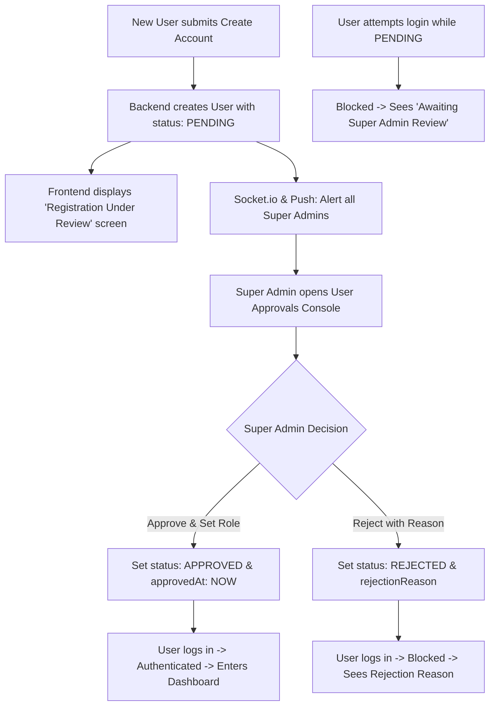

# Super Admin User Review & Approval System Implementation Plan

This implementation plan details the architecture, database schema enhancements, backend security middleware, Super Admin management endpoints, and frontend UI components required to implement a **User Registration Review & Approval Workflow** in **ENG PLANNER**.

---

## 1. Executive Summary & System Workflow

When a new engineer or architect registers on the **Create Account** page:
1. The user account is saved with status **`PENDING`**.
2. No active session token is issued; the user is shown a confirmation screen informing them that their account is pending review.
3. All **Super Admins** receive an immediate real-time alert and push notification about the pending registration.
4. A Super Admin opens the **User Approvals Console** to review user details, assign their verified role, and either **Approve** or **Reject** the application.
5. Only **Approved** users can authenticate and access workspaces.



---

## 2. Database Schema Enhancements (Prisma)

### [MODIFY] [schema.prisma](file:///c:/wamp64/www/eng_planner/backend/prisma/schema.prisma)

```prisma
enum Role {
  ENGINEER
  ARCHITECT
  ADMIN
  SUPER_ADMIN
}

enum UserStatus {
  PENDING
  APPROVED
  REJECTED
  SUSPENDED
}

model User {
  id                String             @id @default(uuid())
  email             String             @unique
  password          String
  fullName          String
  role              Role               @default(ENGINEER)
  status            UserStatus         @default(PENDING)
  rejectionReason   String?            @db.Text
  approvedAt        DateTime?
  approvedById      String?            @db.VarChar(191)
  createdAt         DateTime           @default(now())
  updatedAt         DateTime           @updatedAt
  projects          Project[]
  comments          Comment[]
  commentReplies    CommentReply[]
  groupMembers      GroupMember[]
  chatMessages      ChatMessage[]
  pushSubscriptions PushSubscription[]
  notifications     Notification[]
  notificationPref  NotificationPreference?

  @@index([status])
  @@index([role])
  @@map("user")
}
```

---

## 3. Backend Architecture & API Specifications

### A. Authentication Adjustments (`authService.ts` & `authController.ts`)

1. **`authService.register`**:
   - Creates user with `status: 'PENDING'`.
   - Returns:
     ```json
     {
       "message": "Your registration has been submitted and is pending Super Admin review.",
       "status": "PENDING",
       "user": { "id": "...", "email": "...", "fullName": "...", "status": "PENDING" }
     }
     ```
   - Emits real-time event `admin-user-registered` to Socket room `super-admin-room`.
   - Dispatches in-app and Web Push notification to all users with role `SUPER_ADMIN` or `ADMIN`.

2. **`authService.login`**:
   - Verifies email and password.
   - If password is correct, evaluates user `status`:
     - **`PENDING`**: Throws 403 error: `"Your account is pending review by a Super Admin. You will be able to log in once approved."`
     - **`REJECTED`**: Throws 403 error: `"Your registration was not approved by the administrator. Reason: [rejectionReason]"`
     - **`SUSPENDED`**: Throws 403 error: `"Your account has been suspended. Please contact your system administrator."`
     - **`APPROVED`**: Issues standard JWT token and returns user profile.

---

### B. Super Admin Security Middleware & Endpoints

#### 1. [NEW] [backend/src/middlewares/superAdminMiddleware.ts](file:///c:/wamp64/www/eng_planner/backend/src/middlewares/superAdminMiddleware.ts)
- Verifies that `req.user.role === 'SUPER_ADMIN' || req.user.role === 'ADMIN'`.
- Returns `403 Forbidden` if the user is a standard `ENGINEER` or `ARCHITECT`.

#### 2. [NEW] [backend/src/controllers/adminController.ts](file:///c:/wamp64/www/eng_planner/backend/src/controllers/adminController.ts) & [backend/src/routes/adminRoutes.ts](file:///c:/wamp64/www/eng_planner/backend/src/routes/adminRoutes.ts)
Mounted under `/api/v1/admin/users`:

| Method | Endpoint | Description |
| :--- | :--- | :--- |
| `GET` | `/api/v1/admin/users` | Lists registered users with filters (`?status=PENDING/APPROVED/REJECTED/ALL&search=...`). |
| `GET` | `/api/v1/admin/users/stats` | Returns counts: `{ pending: 3, approved: 12, rejected: 1, total: 16 }`. |
| `PUT` | `/api/v1/admin/users/:id/approve` | Approves user, sets `status: APPROVED`, logs `approvedAt` and `approvedById`, and optionally assigns role. |
| `PUT` | `/api/v1/admin/users/:id/reject` | Rejects user, sets `status: REJECTED` and records `rejectionReason`. |
| `PUT` | `/api/v1/admin/users/:id/role` | Promotes/demotes user (`ENGINEER`, `ARCHITECT`, `ADMIN`, `SUPER_ADMIN`). |
| `DELETE` | `/api/v1/admin/users/:id` | Permanently deletes user account and cascades data. |

---

## 4. Frontend Architecture & UI Components

### A. Create Account & Login Page ([LoginPage.tsx](file:///c:/wamp64/www/eng_planner/frontend/src/pages/LoginPage.tsx))

1. **Post-Registration State**:
   - When a user submits the "Create Account" form, replace the form with an attractive **"Registration Submitted"** confirmation screen:
     - 🛡️ Shield & Clock illustration.
     - Headline: *"Registration Under Review"*.
     - Body: *"Your application has been forwarded to the Super Admin. You will receive access as soon as your profile is approved."*
     - Button: *"Back to Login"*.

2. **Status-Aware Login Alerts**:
   - If a `PENDING` user attempts to log in: Shows an amber info banner: `⏳ Account Pending Review: Your registration is currently being reviewed by a Super Admin.`
   - If a `REJECTED` user attempts to log in: Shows a red error banner with the admin's feedback: `❌ Account Not Approved: [Reason]`.

---

### B. Super Admin User Approval Console

#### 1. [NEW] [frontend/src/components/admin/AdminUserManagementModal.tsx](file:///c:/wamp64/www/eng_planner/frontend/src/components/admin/AdminUserManagementModal.tsx)
A dedicated Super Admin modal accessible from the Dashboard:
- **Header**: Live statistics banner (`3 Pending`, `14 Approved`, `1 Rejected`).
- **Tabbed Interface**:
  - `⏳ Pending Review (3)`: Shows new registrations with applicant name, email, registration timestamp, and quick `[ ✅ Approve ]` and `[ ❌ Reject ]` action buttons.
  - `✅ Approved Users`: Shows active team members with role badge and `[ ⚙️ Change Role ]` / `[ 🚫 Suspend ]` actions.
  - `❌ Rejected`: Shows rejected applications with reason and `[ 🔄 Re-evaluate / Approve ]` button.
- **Reject Reason Dialog**: Clean modal allowing the Super Admin to provide a constructive explanation (e.g. *"Please use your official company engineering email"*).

#### 2. [MODIFY] [frontend/src/pages/DashboardPage.tsx](file:///c:/wamp64/www/eng_planner/frontend/src/pages/DashboardPage.tsx)
- For users with role `SUPER_ADMIN` or `ADMIN`, display a prominent **"🛡️ User Approvals"** button with a real-time red pending badge (e.g. `🔴 2`).
- Clicking the button opens the `AdminUserManagementModal`.

---

## 5. Security & Migration Strategy

1. **Existing Users Migration**:
   - All currently existing users in the database (`danielrillera2@gmail.com`, `danrillera.va@gmail.com`) will be automatically initialized with `status: APPROVED`.
   - Designate the primary administrator account as `SUPER_ADMIN`.
2. **Brute-Force & Role Escalation Protection**:
   - Clients cannot set their own `status` or `role` during registration.
   - `superAdminMiddleware` validates the JWT token against the MySQL database to prevent forged tokens.

---

## 6. Open Questions & Discussion Points for User Review

> [!IMPORTANT]
> **Key Decisions to Align During Our Discussion:**
> 
> 1. **Initial Super Admin Account**:
>    - Which existing email should be designated as the initial **Super Admin**?
>      - `danielrillera2@gmail.com`
>      - `danrillera.va@gmail.com`
>      - Or should we provide an environment seed script?
> 
> 2. **Registration Form Role Selection**:
>    - Should the registration form let applicants request their desired role (e.g. *Engineer* vs. *Architect*), or should the Super Admin assign the role upon approval?
> 
> 3. **Rejection Action Behavior**:
>    - When an account is rejected, should the user record remain in the database marked as `REJECTED` (so they see the rejection reason), or should there also be an option to immediately delete the record?
> 
> 4. **Super Admin In-App & Push Alerts**:
>    - Should Super Admins receive an instant desktop push notification whenever a new account is registered? (Recommended: Yes).

---

## 7. Step-by-Step Implementation Roadmap (Completed)

- [x] **Phase 1: Database Schema & Migration**
  - Update `schema.prisma` with `UserStatus` enum, `SUPER_ADMIN` role, and user status fields.
  - Run `prisma db push` and update existing users to `status: APPROVED`.
- [x] **Phase 2: Backend Authentication & Middleware**
  - Update `authService.register` to default to `PENDING` and omit automatic login token.
  - Update `authService.login` to enforce `status === 'APPROVED'`.
  - Create `superAdminMiddleware.ts`.
- [x] **Phase 3: Super Admin REST API & Socket Gateway**
  - Implement `adminController.ts` and `adminRoutes.ts` (`/api/v1/admin/users/*`).
  - Wire real-time socket events `admin-user-registered` and `admin-user-status-changed`.
- [x] **Phase 4: Frontend Registration & Login UX**
  - Update `LoginPage.tsx` with post-registration confirmation screen and status-aware error banners.
- [x] **Phase 5: Super Admin User Management Console**
  - Build `AdminUsersPage.tsx` with tabs (`Pending`, `Approved`, `Rejected`), statistics, and approval/rejection dialogs.
  - Add Super Admin action button in `DashboardPage.tsx` and `TopNavbar.tsx` with live unread badge.
- [x] **Phase 6: Verification & End-to-End Testing**
  - Test registration of a new user -> verify `PENDING` state blocks login.
  - Super Admin approves user -> verify user can now log in immediately.
  - Super Admin rejects user -> verify user sees rejection explanation.
  - Update `FOR GIT ADD.md` with all modified files.

