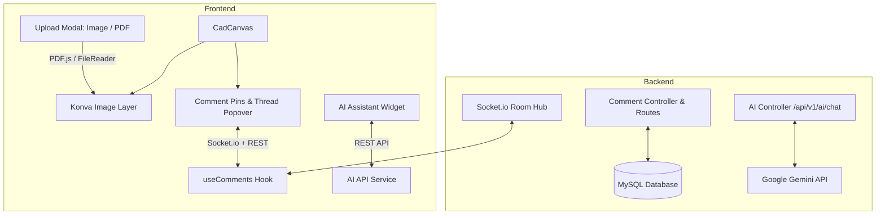

# Implementation Plan - Image/File Upload, Multi-User Canvas Discussion & AI Assistant

This plan outlines the architecture and implementation for three major interconnected features in **Eng Planner**:
1. **Image & Document Upload**: Upload images (`.png, .jpg, .svg, etc.`) or documents (`.pdf`), automatically convert documents to high-resolution canvas images, and render them on the Konva canvas.
2. **Multi-User Discussion & Pinned Comments**: Spatial on-canvas comment pins with threaded discussions, real-time sync across connected users via Socket.io, and a dedicated comments sidebar.
3. **AI Assistant Widget**: A floating, intelligent assistant that provides engineering guidance, analyzes canvas elements, and summarizes discussions.

---

## User Review Required

> [!IMPORTANT]
> **Document to Image Conversion**:
> - We propose using **`pdfjs-dist`** on the client side for PDF-to-image conversion. This provides instant rendering, eliminates server upload delays, supports multi-page selection, and produces crystal-clear raster images ready for Konva canvas layers.
>
> **Real-time Discussion Sync**:
> - Comments are anchored to canvas coordinates `(x, y)`. When a user zooms or pans, the pins stay locked to the exact location on the drawing or uploaded document.
> - Multi-user sync will utilize Socket.io rooms scoped by `projectId` (`project-${projectId}`) to push real-time updates when comments are posted, replied to, or resolved.
>
> **AI Assistant Provider**:
> - The AI Assistant backend will be powered by the **Google Gemini API** (configurable via `GEMINI_API_KEY` in backend `.env`) with fallback support. It will receive contextual snapshots of the current canvas elements and active comment threads to give accurate, drawing-aware answers.

---

## Proposed Architecture



---

## Proposed Changes

### 1. Backend

#### [MODIFY] [schema.prisma](file:///c:/wamp64/www/eng_planner/backend/prisma/schema.prisma)
- Add `Comment` and `CommentReply` models:
  - `Comment`: `id`, `projectId`, `userId`, `x`, `y`, `content`, `isResolved`, `createdAt`, `updatedAt`
  - `CommentReply`: `id`, `commentId`, `userId`, `content`, `createdAt`
  - Relations to `User` and `Project`.

#### [NEW] [backend/src/routes/commentRoutes.ts](file:///c:/wamp64/www/eng_planner/backend/src/routes/commentRoutes.ts) & [commentController.ts](file:///c:/wamp64/www/eng_planner/backend/src/controllers/commentController.ts)
- `GET /api/v1/projects/:projectId/comments` - Fetch all comments and replies for a project.
- `POST /api/v1/projects/:projectId/comments` - Create a new spatial comment pin.
- `POST /api/v1/comments/:commentId/replies` - Reply to an existing comment.
- `PATCH /api/v1/comments/:commentId/resolve` - Toggle resolved status.
- `DELETE /api/v1/comments/:commentId` - Delete comment.

#### [NEW] [backend/src/routes/aiRoutes.ts](file:///c:/wamp64/www/eng_planner/backend/src/routes/aiRoutes.ts) & [aiController.ts](file:///c:/wamp64/www/eng_planner/backend/src/controllers/aiController.ts)
- `POST /api/v1/ai/chat`: Accepts user prompt + drawing context (summary of elements, dimensions, active comments), calls Gemini API, and returns structured engineering suggestions.

#### [MODIFY] [backend/src/index.ts](file:///c:/wamp64/www/eng_planner/backend/src/index.ts)
- Update Socket.io connection logic to support project rooms:
  - `join-project`: Scopes communication to specific project.
  - `new-comment`, `comment-reply-added`, `comment-resolved-updated`, `comment-deleted`: Broadcast to everyone in the project room.
- Register `/api/v1/projects/:projectId/comments` and `/api/v1/ai` route endpoints.

---

### 2. Frontend

#### [MODIFY] [canvas.ts](file:///c:/wamp64/www/eng_planner/frontend/src/types/canvas.ts)
- Add `'image'` to `ToolType`.
- Update `CanvasElement` interface to support:
  - `imageUrl?: string`
  - `imageObj?: HTMLImageElement`
  - `opacity?: number`
  - `locked?: boolean`

#### [NEW] [frontend/src/types/comment.ts](file:///c:/wamp64/www/eng_planner/frontend/src/types/comment.ts)
- Types for `Comment`, `CommentReply`, and spatial pin coordinate state.

#### [NEW] [frontend/src/features/planner/utils/pdfConverter.ts](file:///c:/wamp64/www/eng_planner/frontend/src/features/planner/utils/pdfConverter.ts)
- Utility to load `.pdf` files using `pdfjs-dist` and render any selected page into a high-DPI canvas image `dataUrl` or `HTMLImageElement`.

#### [NEW] [frontend/src/components/modals/UploadMediaModal.tsx](file:///c:/wamp64/www/eng_planner/frontend/src/components/modals/UploadMediaModal.tsx)
- Modal supporting drag & drop for:
  - Images (`.png`, `.jpg`, `.jpeg`, `.webp`, `.svg`)
  - Documents (`.pdf`) with page selector thumbnail preview if multi-page.
- Automatic conversion and immediate placement onto the canvas at center/cursor with aspect-ratio preserving dimensions.

#### [MODIFY] [DrawingLayer.tsx](file:///c:/wamp64/www/eng_planner/frontend/src/components/canvas/DrawingLayer.tsx)
- Add Konva `Image` rendering for elements of type `'image'`.
- Support scaling, moving, opacity control, and locking for background reference plans.

#### [NEW] [frontend/src/components/canvas/CommentPinLayer.tsx](file:///c:/wamp64/www/eng_planner/frontend/src/components/canvas/CommentPinLayer.tsx)
- Konva overlay layer rendering interactive comment pins on the canvas:
  - Numbered pin markers with user avatars/initials and pulsing indicators.
  - Hover states and click handler to open the discussion thread popover.
  - Color-coded badges for active vs resolved threads.

#### [NEW] [frontend/src/components/comments/CommentPopover.tsx](file:///c:/wamp64/www/eng_planner/frontend/src/components/comments/CommentPopover.tsx)
- Floating thread card anchored to the active comment pin:
  - Display author info, timestamp, and message.
  - Thread replies list with input box to reply.
  - Actions: Resolve/Reopen thread, delete comment.

#### [NEW] [frontend/src/components/comments/CommentsSidebar.tsx](file:///c:/wamp64/www/eng_planner/frontend/src/components/comments/CommentsSidebar.tsx)
- Collapsible sidebar on the right side listing all discussions across the project.
- Filter by All / Active / Resolved.
- Clicking any thread automatically pans/zooms the canvas to focus on that pin.

#### [NEW] [frontend/src/components/ai/AIAssistantWidget.tsx](file:///c:/wamp64/www/eng_planner/frontend/src/components/ai/AIAssistantWidget.tsx)
- Floating modern dockable widget at the bottom-right corner.
- Collapsible into an icon with unread badge or expanded into a rich chat UI.
- Quick action chips:
  - *"Analyze this drawing layout"*
  - *"Summarize active discussion threads"*
  - *"Check dimension & scale compliance"*
  - *"Suggest engineering improvements"*
- Context injection: passes current element count, drawing bounds, dimensions, and comment summaries to the AI.

#### [MODIFY] [TopNavbar.tsx](file:///c:/wamp64/www/eng_planner/frontend/src/components/layout/TopNavbar.tsx) & [PlannerWorkspace.tsx](file:///c:/wamp64/www/eng_planner/frontend/src/components/layout/PlannerWorkspace.tsx)
- Add "Upload Image/File" button in `TopNavbar.tsx`.
- Add "Comments" toggle button with badge in `TopNavbar.tsx`.
- Add "Place Comment Pin" tool trigger.
- Mount `UploadMediaModal`, `CommentsSidebar`, `CommentPopover`, and `AIAssistantWidget` in `PlannerWorkspace.tsx`.

---

## Verification Plan

### Automated Tests
1. **Backend Tests**:
   - Test comment creation, reply addition, and resolution status endpoints.
   - Test AI chat route validation and mock response.
   ```bash
   cd backend && npm test
   ```
2. **Frontend Tests**:
   - Vitest tests for `pdfConverter`, `useComments` hook, and image element creation.
   - Type check and build:
   ```bash
   cd frontend && npm run build
   cd frontend && npm run test
   ```

### Manual Verification Scenarios
1. **Image & Document Upload**:
   - Upload a PNG/JPEG: verify it appears on the canvas, scales properly, and can be drawn over.
   - Upload a PDF: verify auto-conversion to image, page selection, and placement on the canvas.
2. **Multi-User Discussion**:
   - Click "Add Comment" and place a pin on a specific detail of the uploaded plan.
   - Open a second browser tab/window, verify the pin appears instantly in real time.
   - Post replies from both users, verify conversation updates live.
   - Mark as resolved and verify badge change and sidebar update.
3. **AI Assistant Widget**:
   - Open AI widget, send a query (e.g. *"Summarize this drawing and the comments"*), verify smart response grounded in current canvas data.
